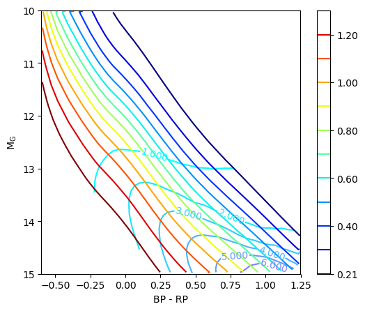
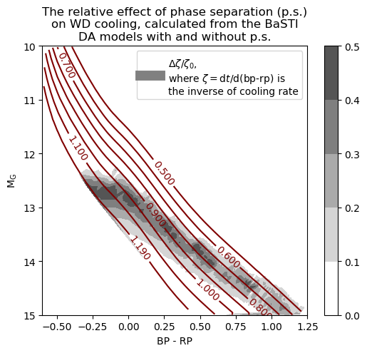

# WD_models
I provide a python module for transformation between broad-band photometry and many white dwarf (WD) physical parameters (mass, cooling age, Teff, etc), based on an interpolation of cooling tracks from various existing WD models (see below). In particular, this module makes it easy to reading WD parameters according to its coordinate on the *Gaia* H--R diagram. 

This module is written for python 3 and will use functions from the following packages: `astropy, matplotlib, numpy, scipy`. It is designed mainly for the following purposes:

1. converting the coordinates of *Gaia* (and other) H--R diagram into WD parameters;
2. plotting contours of WD parameters on the *Gaia* (and other) H--R diagram.

The tools provided with the module also make it easy to transform between any desired WD parameters. Below, I introduce the basic usage and give some examples. Some detailed information of the cooling tracks models and are also shown.


## Import
Please download the script `WD_models.py` and folder `models/` to the same directory, and simply import the module in python 3:
```python
import WD_models
```

## Example 1: converting H--R diagram coordinate into WD parameters
```python
model = WD_models.load_model(low_mass_model='Fontaine2001',
                             normal_mass_model='Althaus2010_001',
                             high_mass_model='ONe',
                             spec_type='DA_thick')
                             
# the cooling age at (BP-RP, G) = (0.25, 13) and (0.25, 14)
age_cool = model['HR_to_age_cool']([0.25, 0.25], [13,14])

print(age_cool)
>> [ 1.27785237  2.70106702]
```
The outputs are in unit of Gyr. The *Function* `load_model` in the module reads a set of cooling tracks and returns a dictionary containing many useful functions for parameter transformation and grid data for ploting contours. The keys of this dictionary are listed in table ? below.

With the argument `HR_bands`, one can change the passband for both the color index and absolute magnitude of the H--R diagram. It can be any combination from the following bands: G, bp, rp (Gaia), u, g, r, i, z (SDSS), U, B, V, R, I, J, H, K (Johnson). For example:
```python
model = WD_models.load_model('f', 'a001', 'o', 'DA_thick',
                             HR_bands=('u-g', 'G'))
```
Also, shorter names for the same cooling models are used here. (See "Available models included in this module" below.)

Loading two sets of models allows the comparison between cooling models. For example:
```python
model_A = WD_models.load_model('', 'b', 'b', 'DA_thick')
model_B = WD_models.load_model('', 'b', 'b', 'DB')

d_age_cool = model_A['HR_to_age_cool'](0, 13) - model_B['HR_to_age_cool'](0, 13)

print(d_age_cool)
>> 0.269691616685
```

## Example 2: plotting contours on the H--R diagram



The contours can be plotted using the grid data in the output of `load_model` function. To make sure the coordinates matching, the argument `HR_grid` of the function `load_model` should be used, and the same values should also be used for the `extent` of contour plotting. 
```python
HR_grid = (-0.6, 1.25, 0.002, 10, 15, 0.01)
model = WD_models.load_model('f', 'f', 'f', 'DA_thick', HR_grid=HR_grid) 

# get rid of some artifects of interpolation
grid_x, grid_y = np.mgrid[HR_grid[0]:HR_grid[1]:HR_grid[2], HR_grid[3]:HR_grid[4]:HR_grid[5]]
model['grid_HR_to_age_cool'][model['HR_to_mass'](grid_x, grid_y) < 0.21] = np.nan

plt.figure(figsize=(6,5),dpi=100)

# plot cooling age contours
CS = plt.contour(model['grid_HR_to_age_cool'].T,
                 levels=[1, 2, 3, 4, 5, 6, 7, 8, 9, 10, 11], 
                 extent=(HR_grid[0],HR_grid[1],HR_grid[3],HR_grid[4]),
                 aspect='auto', origin='lower', cmap='cool')
plt.clabel(CS, inline=True, use_clabeltext=True)

# plot mass contours
plt.contour(model['grid_HR_to_mass'].T,
            levels=[0.21, 0.3, 0.4, 0.5, 0.6, 0.7, 0.8, 0.9, 1.0, 1.1, 1.2, 1.29], 
            extent=(HR_grid[0],HR_grid[1],HR_grid[3],HR_grid[4]),
            aspect='auto', origin='lower')
plt.colorbar()

plt.title('Mass and cooling-age contours\nfrom the Montreal cooling model')
plt.gca().invert_yaxis()
plt.xlabel('BP - RP')
plt.ylabel('$\\rm M_G$')
plt.show()
```

## Example 3: the effect of phase separation



Here I show an interesting visualization based on the BaSTI cooing tracks with and without phase separation.
```python
# load the BaSTI models with and without phase separation
HR_grid = (-0.6, 1.25, 0.002, 10, 15, 0.01)
model_1 = WD_models.load_model('f', 'b', 'b', 'DA_thick', HR_grid=HR_grid) 
model_2 = WD_models.load_model('f', 'bn', 'bn', 'DA_thick', HR_grid=HR_grid)

plt.figure(figsize=(6,5),dpi=100)

# plot the mass contour
CS = plt.contour(model_1['grid_HR_to_mass'].T,
                 levels=[0.5, 0.6, 0.7, 0.8, 0.9, 1.0, 1.1, 1.19], 
                 extent=(HR_grid[0],HR_grid[1],HR_grid[3],HR_grid[4]),
                 aspect='auto', origin='lower', cmap='jet', vmin=-1000)
plt.clabel(CS, inline=True, use_clabeltext=True)

# plot the slowing-down effect of phase separation
contrast = ((model_1['grid_HR_to_cool_rate^-1'] - model_2['grid_HR_to_cool_rate^-1']) /
            (model_2['grid_HR_to_cool_rate^-1'])).T
plt.contourf(contrast, 
             levels=[0.00, 0.10, 0.20, 0.30, 0.40, 0.50],
             extent=(HR_grid[0],HR_grid[1],HR_grid[3],HR_grid[4]),
             aspect='auto', origin='lower', cmap='binary', vmin=0.05, vmax=0.65)
plt.colorbar()

# plot the legend
plt.plot([0,0],[1,1],'-', color='gray', lw=10, 
         label='$\\Delta\\zeta/\\zeta_0$,\n' +
                'where $\\zeta=$d$t$/d(bp-rp) is\n' + 
                'the inverse of cooling rate')
plt.legend()

# set the figure
plt.title('The relative effect of phase separation (p.s.)\n' +
          'on WD cooling, calculated from the BaSTI\n' + 
          'DA models with and without p.s.')
plt.xlabel('BP - RP')
plt.ylabel('$\\rm M_G$')
plt.xlim(-0.6,1.25)
plt.ylim(15,10)
plt.show()
```

## Example 4: transformation between any desired WD parameters

If a desired transformation function is not provided in the output of `load_model`, (e.g., (mass, Teff) --> cooling age,) the user can generate the mapping with the function `interp_xy_z_func`, `interp_xy_z`, or `interp_HR_to_para` in this module, based on the cooling-track data points and atmosphere grid provided as the output of `load_model`. 

For example, for the mapping (mass, logteff) --> cooling age:
```python
model = WD_models.load_model('f', 'a001', 'o', 'DA_thick')

# interpolate the desired mapping
m_logteff_to_agecool = WD_models.interp_xy_z_func(x=model['mass_array'],
                                                  y=model['logteff'],
                                                  z=model['age_cool'],
                                                  interp_type='linear')
                                                  
# the cooling age for (m_WD, Teff) = (1.1 Msun, 10000 K)
age_cool = m_logteff_to_agecool(1.1, np.log10(10000))

print(age_cool)
>> 2.1917495897185257
```
As other transformation functions, this customized mapping function `m_logteff_to_agecool` also accepts numpy array as input.

## Available models included in this module

### Low-mass models (less than about 0.5 Msun)

model names | remarks & reference
------------|----------------------
''                              |no low-mass model will be read
'Fontaine2001' or 'f'           |http://www.astro.umontreal.ca/~bergeron/CoolingModels/

### Normal-mass models (about 0.5 to 1.0 Msun)

model names | remarks & reference
------------|----------------------
''                              |no normal-mass model will be read
'Fontaine2001' or 'f'           |http://www.astro.umontreal.ca/~bergeron/CoolingModels/
'Althaus2010_001' or 'a001'     |Z=0.01, only for DA, http://evolgroup.fcaglp.unlp.edu.ar/TRACKS/tracks_cocore.html
'Althaus2010_0001' or 'a0001'   |Z=0.001, only for DA, http://evolgroup.fcaglp.unlp.edu.ar/TRACKS/tracks_cocore.html
'Camisassa2017' or 'c'          |only for DB, http://evolgroup.fcaglp.unlp.edu.ar/TRACKS/tracks_DODB.html
'BaSTI' or 'b'                  |with phase separation, Salaris et al. 2010, http://basti.oa-teramo.inaf.it
'BaSTI_nosep' or 'bn'           |no phase separation, Salaris et al. 2010, http://basti.oa-teramo.inaf.it
'PG'                            |only for DB

### High-mass models (higher than 1.0 Msun)

model names | remarks & reference
------------|----------------------
''                              |no high-mass model will be read
'Fontaine2001' or 'f'           |http://www.astro.umontreal.ca/~bergeron/CoolingModels/
'ONe' or 'o'                    |Camisassa et al. 2019, http://evolgroup.fcaglp.unlp.edu.ar/TRACKS/ultramassive.html
'MESA' or 'm'                   |Lauffer et al. 2019
'BaSTI' or 'b'                  |with phase separation, Salaris et al. 2010, http://basti.oa-teramo.inaf.it
'BaSTI_nosep' or 'bn'           |no phase separation, Salaris et al. 2010, http://basti.oa-teramo.inaf.it

### Spectral type and atmosphere sythetic colors

We interpolate the table of sythetic colors from http://www.astro.umontreal.ca/~bergeron/CoolingModels/). The spectral type can be one of the following:

spectral type | remarks
--------------|----------------------
'DA_thick'    | thick hydrogen atmosphere
'DA_thin'     | thin hydrogen atmosphere
'DB'          | pure-helium atmosphere
     
## Output of the function `load_model`

The function `load_model` returns a dictionary, which contains the atmosphere grids and mapping, parameter mappings, and stacked cooling-track data points. The keys of this dictionary are:

### Interpolation results

    ========================================================================
      category   | interpolated values on a grid | interpolated mapping
      var. type  |     2d-array                  |     Function
    ========================================================================
       atm.      | 'grid_logteff_logg_to_BC'     | 'logteff_logg_to_BC'
                 | 'grid_logteff_logg_to_color'  | 'logteff_logg_to_color'
    ------------------------------------------------------------------------
     HR -->      | 'grid_HR_to_mass'             | 'HR_to_mass'
     WD para.    | 'grid_HR_to_logg'             | 'HR_to_logg'
                 | 'grid_HR_to_age'              | 'HR_to_age'
                 | 'grid_HR_to_age_cool'         | 'HR_to_age_cool'
                 | 'grid_HR_to_logteff'          | 'HR_to_logteff'
                 | 'grid_HR_to_Mbol'             | 'HR_to_Mbol'
                 | 'grid_HR_to_cool_rate^-1'     | 'HR_to_cool_rate^-1'
    ------------------------------------------------------------------------
     others      |                               | 'm_agecool_to_color'
                 |                               | 'm_agecool_to_Mag'
    ======================================================================== 

### Cooling-track data points

name | remarks
-----|---------
'mass_array':   | 1d-array. The mass of WD in unit of solar mass. I only read one value for a cooling track, not tracking the mass change.
'logg':         | 1d-array. in cm/s^2
'age':          | 1d-array. The total age of the WD in yr. Some are read directly from the cooling tracks, but others are calculated by assuming an initial--final mass relation (IFMR) of the WD and adding the rough main-sequence age to the cooling age.
'age_cool':     | 1d-array. The cooling age of the WD in yr.
'logteff':      | 1d-array. The logarithm effective temperature of the WD in Kelvin (K).
'Mbol':         | 1d-array. The absolute bolometric magnitude of the WD. Many are converted from the log(L/Lsun) or log(L), where I adopt: Mbol_sun = 4.75, Lsun = 3.828e33 erg/s.
'cool_rate^-1': | 1d-array. The reciprocal of cooling rate dt / d(bp-rp), in Gyr/mag.
'Mag':          | 1d-array. The chosen absolute magnitude, converted from the atmosphere interpolation.
'color':        | 1d-array. The chosen color index, converted from the atmosphere interpolation.
