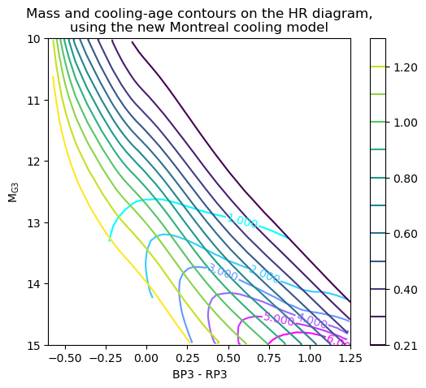
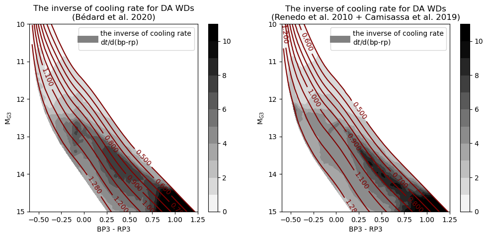

# WD_models
(Updated on Jan 15, 2020. For details of updates please check update.md)

The number of white dwarfs (WD) with precise luminosity and color measurements has been increased drastically by *Gaia* DR2. Accordingly, the need for a tool to easily transform WD photometry to physical parameters (and vice versa) emerges. Here, I provide a python module for such transformations, based on interpolation of existing WD atmosphere grid and cooling models. This module is written for python 3 and depends on the following packages: `astropy, matplotlib, numpy, scipy`. The most useful functions include:

1. converting the coordinates of *Gaia* (and other passbands) H--R diagram into WD parameters;
2. plotting contours of WD parameters on the *Gaia* (and other passbands) H--R diagram.

It also provides tools to transform any desired WD parameters and compare the results of different WD models. In addition, the user may custimize many parameters, such as the choice of cooling models and setting details of plotting.

If you use this tool, don't forget to cite this website and the corresponding papers of synthetic colors and cooling models (see the reference at the bottom of this page). If you have more cooling models and/or synthetic colors, I am more than happy to add them to this module!

Below, I introduce the basic usage of this module, give some examples. A list of available cooling models is attached. I also present a detailed introduction to the output of the main function `load_model`. I hope that with a convenience way provided to transform WD parameters, more researchers will be attracted to the WD field, and the connection between observers, theorists, and astronomers from outside the WD field will be tighter. For questions or suggestions or comments, please do not hesitate to contact me: s.cheng@jhu.edu


## Install
Please download the package `WD_models` to one of the system paths of your python, and then simply import it in python 3:
```python
import WD_models
```
To check the system paths,
```python
import sys
print(sys.path)
```


## Example 1: converting H--R diagram coordinate into WD parameters
```python
model = WD_models.load_model(low_mass_model='Fontaine2001',
                             middle_mass_model='Fontaine2001',
                             high_mass_model='ONe',
                             atm_type='H')
bp_rp = np.array([0.25, 0.25])
G = np.array([13,14])
age_cool = model['HR_to_age_cool'](bp_rp, G)

print('bp_rp: ', bp_rp, '\nM_G: ', G)
print('cooling ages:', age_cool, 'Gyr')
>> bp_rp:	[ 0.25  0.25] 
>> M_G:	[13 14]
>> cooling ages: [ 1.26162464  2.83953083] Gyr
```
The outputs are in unit of Gyr. The function `load_model` in the module reads a set of cooling tracks and returns a dictionary containing many useful functions for parameter transformation and grid data for ploting contours. The keys of this dictionary are listed in the section "output of the function `load_model`" below.

With the argument `HR_bands`, one can change the passband for both the color index and absolute magnitude of the H--R diagram. It can be any combination from the following bands: 

filter system | filters | filter names in this package
--------------|---------|------------------------------
Gaia          | G, bp, rp         | G, bp, rp
SDSS          | u, g, r, i, z     | Su, Sg, Sr, Si, Sz
PanSTARRS     | g, r, i, z, y     | Pg, Pr, Pi, Pz, Py
Johnson       | U, B, V, R, I     | U, B, V, R, I
2MASS         | J, H, Ks          | J, H, Ks
Mauna Kea Observatory (MKO)| Y, J, H, K | MY, MJ, MH, MK
WISE          | W1, W2, W3, W4    | W1, W2, W3, W4
Spitzer       | 3.6, 4.5, 5.8, 8.0| S36, S45, S58, S80
GALEX         | FUV, NUV          | FUV, NUV

For example:
```python
model = WD_models.load_model('f', 'f', 'o', 'H',
                             HR_bands=('Su-Sg', 'G'),)
```
Note that shorter names of the same cooling models (see section "Available models included in this module" below for details) are used here.

Loading two sets of models allows the comparison between cooling models. For example:
```python
model_A = WD_models.load_model('', 'f', 'f', 'H')
model_B = WD_models.load_model('', 'f', 'f', 'He')

d_age_cool = (model_A['HR_to_age_cool'](0, 13) - model_B['HR_to_age_cool'](0, 13))

print('bp-rp = 0,  M_G = 13')
print('difference of cooling ages between DA and DB models: ', d_age_cool, 'Gyr')
>> bp-rp = 0,  M_G = 13
>> difference of cooling ages between DA and DB models:  0.108108710416 Gyr
```


## Example 2: plotting contours on the H--R diagram



The contours can be plotted using the grid data in the output of function `load_model`. To make sure the coordinates match, the argument `HR_grid` of function `load_model` should be used, and the same values should also be used for the `extent` of contour plotting.
```python
HR_grid = (-0.6, 1.25, 0.002, 10, 15, 0.01)
model = WD_models.load_model('f', 'f', 'f', 'H', HR_grid=HR_grid)
extent = (HR_grid[0], HR_grid[1], HR_grid[3], HR_grid[4])
plt.contour(model['grid_HR_to_mass'].T, extent=extent)
plt.contour(model['grid_HR_to_age_cool'].T, extent=extent)
```
Codes for plotting the exact figure (and figures below) are provided in the jupyter notebook `/WD_models_examples.ipynb`.

A comment: The total age is a very steep function of white dwarf mass and not suitable for interpolation. So, for plotting the contour or other use of the total age, the following way is recommend:
```python
plt.contour(
    model['grid_HR_to_age_cool'].T + WD_models.MS_age(model['grid_HR_to_mass'].T)*1e-9,
    extent=extent)
```


## Example 3: the effect of phase separation

 

In the output of function `load_model` I also provide the cooling rate information dt / d(bp-rp), which is the inverse of cooling rate. If the cooling is low in one region of the H--R diagram, WDs will pile-up there; the number density on the H--R diagram is proportional to the inverse of cooling rate dt / d(bp-rp). The above figures are the inverse of cooling rate for two different models.
```python
plt.contourf(model['grid_HR_to_cool_rate^-1'].T, extent=extent)
```

I also show an interesting visualization based on the BaSTI cooing tracks with and without phase separation.

 


## Example 4: plotting cooling tracks on H--R diagram


For DA white dwarfs, there is a turning of color at low temperature. So, when interpolating the mapping HR --> WD parameters, I cut off the low-temperature part to avoid artifacts. This cut can be set with the argument `logteff_logg_grid`, which includes six elements for (xmin, xmax, dx, ymin, ymax, dy), and the default value for min_logteff is 3.5, i.e. Teff about 3200 K. 

For ploting the cooling-tracks data points on the H--R diagram, the low-temperature cut is not necessary. So, the first element in `logteff_logg_grid` can be set to a lower value to avoid this cut:
```python
logteff_logg_grid = (3.0, 5.1, 0.01, 6.5, 9.6, 0.01)
model = WD_models.load_model('f', 'f', 'f', 'H', 
                             HR_bands=('g-i','g'), 
                             logteff_logg_grid=logteff_logg_grid)
plt.scatter(model['color'], model['Mag'], c=model['logteff'])
```
Note that this H--R diagram is for SDSS passbands.


## Example 5: transformation between any desired WD parameters

If a desired transformation function is not provided in the output of `load_model`, e.g., (mass, Teff) --> cooling age, the user can generate the customized mapping with the functions `interp_xy_z_func`, `interp_xy_z`, or `interp_HR_to_para` provided in this module. These functions read the cooling-track data points from the output of `load_model` and then generate new mappings. 

For example, for the mapping (mass, logteff) --> cooling age:
```python
model = WD_models.load_model('f', 'f', 'o', 'H')

# interpolate the desired mapping
m_logteff_to_agecool = WD_models.interp_xy_z_func(x=model['mass_array'],
                                                  y=model['logteff'],
                                                  z=model['age_cool'],
                                                  interp_type='linear')
                                                  
# calculate the cooling age for (m_WD, Teff) = (1.1 Msun, 10000 K)
age_cool = m_logteff_to_agecool(1.1, np.log10(10000))

print('mass: 1.1 Msun,  Teff: 10000 K')
print('cooling age: ', age_cool, 'Gyr')
>> mass: 1.1 Msun,  Teff: 10000 K
>> cooling age:  2.1917495897185257 Gyr
```
As other transformation functions, this customized mapping function `m_logteff_to_agecool` also accepts numpy array as input.


## Available models included in this module

I include several classical and recent cooling models published in the literature. If you have a model and want it to be included, please send me your cooling tracks and I am willing to add them here.

### Low-mass models (less than about 0.5 Msun)

model names | short names | remarks & reference
------------|-------------|----------------------
''           |                 |no low-mass model will be read
'Fontaine2001' | 'f'           |the thick-H- or He-atmosphere CO WD model in http://www.astro.umontreal.ca/~bergeron/CoolingModels/. A somewhat "classical" model.
'Fontaine2001_thin' | 'ft'     |the thin-hydrogen CO WD model in http://www.astro.umontreal.ca/~bergeron/CoolingModels/

### Middle-mass models (about 0.5 to 1.0 Msun)

model names | short names | remarks & reference
------------|-------------|----------------------
''         |                   |no middle-mass model will be read
'Fontaine2001' | 'f'           |the thick-H- or He-atmosphere CO WD model in http://www.astro.umontreal.ca/~bergeron/CoolingModels/. A somewhat "classical" model.
'Fontaine2001_thin' | 'ft'     |the thin-H CO WD model in http://www.astro.umontreal.ca/~bergeron/CoolingModels/
'Renedo2010_001' | 'r001'      |Z=0.01, only for DA, http://evolgroup.fcaglp.unlp.edu.ar/TRACKS/tracks_cocore.html
'Renedo2010_0001' | 'r0001'    |Z=0.001, only for DA, http://evolgroup.fcaglp.unlp.edu.ar/TRACKS/tracks_cocore.html
'Camisassa2017' | 'c'          |only for DB, http://evolgroup.fcaglp.unlp.edu.ar/TRACKS/tracks_DODB.html
'BaSTI' | 'b'                  |with phase separation, Salaris et al. 2010, http://basti.oa-teramo.inaf.it. This model predicts very slow cooling rate after crystallization, compared with other models.
'BaSTI_nosep' | 'bn'           |no phase separation, Salaris et al. 2010, http://basti.oa-teramo.inaf.it. This model predicts very slow cooling rate after crystallization, compared with other models.

### High-mass models (higher than 1.0 Msun)

model names | short names | remarks & reference
------------|-------------|----------------------
''         |                   |no high-mass model will be read
'Fontaine2001' | 'f'           |the thick-H- or He-atmosphere CO WD model in http://www.astro.umontreal.ca/~bergeron/CoolingModels/. A somewhat "classical" model.
'Fontaine2001_thin' | 'ft'     |the thin-H CO WD model in http://www.astro.umontreal.ca/~bergeron/CoolingModels/
'ONe' | 'o'                    |Camisassa et al. 2019, http://evolgroup.fcaglp.unlp.edu.ar/TRACKS/ultramassive.html. A very recent model for O/Ne-core WDs, including phase separation. High-mass WDs from single-star evolution are supposed to hold O/Ne cores.
'MESA' | 'm'                   |Lauffer et al. 2018. Evolving intermediate-mass stars into high-mass WDs with MESA.
'BaSTI' | 'b'                  |with phase separation, Salaris et al. 2010, http://basti.oa-teramo.inaf.it. This model predicts very slow cooling rate after crystallization, compared with other models.
'BaSTI_nosep' | 'bn'           |no phase separation, Salaris et al. 2010, http://basti.oa-teramo.inaf.it. This model predicts very slow cooling rate after crystallization, compared with other models.

### Spectral type and atmosphere sythetic colors

We interpolate the table of sythetic colors from http://www.astro.umontreal.ca/~bergeron/CoolingModels/). The spectral type can be one of the following:

spectral type | remarks
--------------|----------------------
'H'           | pure-H atmosphere 
'He'          | pure-He atmosphere

## The output of function `load_model`

The function `load_model` returns a dictionary, which contains several sets of grid data for plotting the contour of WD parameters on the H--R diagram and functions for mapping between photometry and WD parameters. It also returns all the data points read from the cooling tracks, so that the user may customize other transformations between these parameters and broadband photometry.

The keys of this dictionary are:

### Interpolation results

    ========================================================================
      category   | interpolated values on a grid | interpolated mapping
      var. type  |     2d-array                  |     Function
    ========================================================================
       atm.      | 'grid_logteff_logg_to_BC'     | 'logteff_logg_to_BC'
                 | 'grid_logteff_logg_to_color'  | 'logteff_logg_to_color'
    ------------------------------------------------------------------------
     HR -->      | 'grid_HR_to_mass'             | 'HR_to_mass'
     WD para.    | 'grid_HR_to_logg'             | 'HR_to_logg'
                 | 'grid_HR_to_age'              | 'HR_to_age'
                 | 'grid_HR_to_age_cool'         | 'HR_to_age_cool'
                 | 'grid_HR_to_logteff'          | 'HR_to_logteff'
                 | 'grid_HR_to_Mbol'             | 'HR_to_Mbol'
                 | 'grid_HR_to_cool_rate^-1'     | 'HR_to_cool_rate^-1'
    ------------------------------------------------------------------------
     others      |                               | 'm_agecool_to_color'
                 |                               | 'm_agecool_to_Mag'
    ======================================================================== 

### Cooling-track data points

key  | remarks
-----|---------
'mass_array':   | 1d-array. The mass of WD in unit of solar mass. I only read one value for a cooling track, not tracking the mass change.
'logg':         | 1d-array. in cm/s^2
'age':          | 1d-array. The total age of the WD in yr. For the following models, these total ages are read directly from the cooling tracks: 'Camisassa2017', 'ONe', 'MESA'; for all other models, the total ages are calculated by assuming an initial--final mass relation (IFMR) of the WD and adding the rough main-sequence age (equation 18 and 18a in Iben & Tutukov, 1987) to the cooling age.
'age_cool':     | 1d-array. The cooling age of the WD in yr.
'logteff':      | 1d-array. The logarithm effective temperature of the WD in Kelvin (K).
'Mbol':         | 1d-array. The absolute bolometric magnitude of the WD. Many are converted from the log(L/Lsun) or log(L), where I adopt: Mbol_sun = 4.75, Lsun = 3.828e33 erg/s.
'cool_rate^-1': | 1d-array. The reciprocal of cooling rate dt / d(bp-rp), in Gyr/mag.
'Mag':          | 1d-array. The chosen absolute magnitude, converted from the atmosphere interpolation.
'color':        | 1d-array. The chosen color index, converted from the atmosphere interpolation.

For the calculation of total ages, I adopt the IFMR from Cummings et al. 2018 for WDs above 0.55 Msun. For lower masses, which is less useful, I just interpolated between zero and the first data point of Cummings et al. 2018. The pre-WD age is determined based on the MIST (Choi et al. 2016) result for non-rotation, solar metallicity stars. The details can be found in the definition of the `MS_age` function (which converts white dwarf mass to pre-WD age).


## References
Bergeron et al. ([2011ApJ...737...28B](https://ui.adsabs.harvard.edu/abs/2011ApJ...737...28B/abstract))

Blouin et al. ([2018ApJ...863..184B](https://ui.adsabs.harvard.edu/abs/2018ApJ...863..184B/abstract))

Camisassa et al. ([2017ApJ...839...11C](https://ui.adsabs.harvard.edu/abs/2017ApJ...839...11C/abstract))

Camisassa et al. ([2019A&A...625A..87C](https://ui.adsabs.harvard.edu/abs/2019A&A...625A..87C/abstract))

Choi et al. ([2016ApJ...823..102C](https://ui.adsabs.harvard.edu/abs/2016ApJ...823..102C/abstract))

Cummings et al. ([2018ApJ...866...21C](https://ui.adsabs.harvard.edu/abs/2018ApJ...866...21C/abstract))

Fontaine et al. ([2001PASP..113..409F](https://ui.adsabs.harvard.edu/abs/2001PASP..113..409F/abstract))

Holberg & Bergeron ([2006AJ....132.1221H](https://ui.adsabs.harvard.edu/abs/2006AJ....132.1221H/abstract))

Kowalski & Saumon ([2006ApJ...651L.137K](https://ui.adsabs.harvard.edu/abs/2006ApJ...651L.137K/abstract))

Lauffer et al. ([2018MNRAS.480.1547L](https://ui.adsabs.harvard.edu/abs/2018MNRAS.480.1547L/abstract))

Renedo et al. ([2010ApJ...717..183R](https://ui.adsabs.harvard.edu/abs/2010ApJ...717..183R/abstract))

Salaris et al. ([2010ApJ...716.1241S](https://ui.adsabs.harvard.edu/abs/2010ApJ...716.1241S/abstract))

Tremblay et al. ([2011ApJ...730..128T](https://ui.adsabs.harvard.edu/abs/2011ApJ...730..128T/abstract))

http://basti.oa-teramo.inaf.it

http://evolgroup.fcaglp.unlp.edu.ar/TRACKS/tracks.html

http://www.astro.umontreal.ca/~bergeron/CoolingModels
